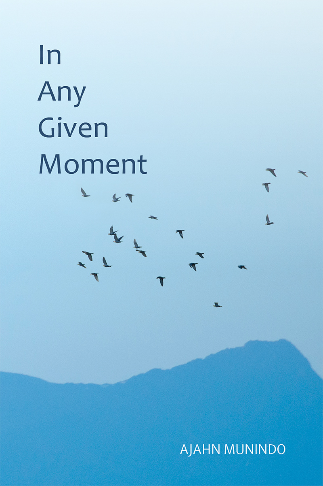

= In Any Given Moment
:booktitle: {doctitle}
:author: Ajahn Munindo
:creator: {author}
:version: v1.0
:revdate: 2021-03-18
:doctype: book
:lang: en
:pubs-logo: aruno-pubs.jpg
:publisher-name: Aruno Publications
:publisher-link-name: ratanagiri.org.uk
:publisher-link-url: https://ratanagiri.org.uk/
:source: https://ratanagiri.org.uk/
:keywords: Dhamma, Buddhism, RELIGION / Buddhism / Theravada
:copyright: CC-BY-NC-ND 4.0
:isbn: 978-1-908444-68-4
:identifier: isbn:{isbn}
:imagesdir: assets/photos/300dpi
:includes: manuscript/asciidoc
:front-cover-image: 
:toc: left
:toc-title: Contents
:toclevels: 1

include::{includes}/titlepage.adoc[]

include::{includes}/opening.adoc[]

include::{includes}/preface.adoc[]

include::{includes}/01-00-part.adoc[]

include::{includes}/01-01-river.adoc[]
include::{includes}/01-02-different.adoc[]
include::{includes}/01-03-albert.adoc[]
include::{includes}/01-04-difficult.adoc[]
include::{includes}/01-05-leave.adoc[]

include::{includes}/02-00-part.adoc[]

include::{includes}/02-01-world.adoc[]
include::{includes}/02-02-sundays.adoc[]
include::{includes}/02-03-lifelines.adoc[]
include::{includes}/02-04-journeying.adoc[]
include::{includes}/02-05-leave-again.adoc[]
include::{includes}/02-06-foreign.adoc[]

include::{includes}/03-00-part.adoc[]

include::{includes}/03-01-reorientation.adoc[]
include::{includes}/03-02-next.adoc[]
include::{includes}/03-03-asia.adoc[]
include::{includes}/03-04-clouds.adoc[]
include::{includes}/03-05-free.adoc[]
include::{includes}/03-06-perspectives.adoc[]
include::{includes}/03-07-encounter.adoc[]
include::{includes}/03-08-lessons.adoc[]
include::{includes}/03-09-rains.adoc[]

include::{includes}/04-00-part.adoc[]

include::{includes}/04-01-missing.adoc[]
include::{includes}/04-02-disorientation.adoc[]
include::{includes}/04-03-forest.adoc[]
include::{includes}/04-04-spirit.adoc[]
include::{includes}/04-05-reconfig.adoc[]
include::{includes}/04-06-burning.adoc[]
include::{includes}/04-07-visiting.adoc[]
include::{includes}/04-08-time.adoc[]

include::{includes}/05-00-part.adoc[]

include::{includes}/05-01-monk.adoc[]
include::{includes}/05-02-spreading.adoc[]
include::{includes}/05-03-relief.adoc[]
include::{includes}/05-04-emerging.adoc[]
include::{includes}/05-05-letting-go.adoc[]
include::{includes}/05-06-speak.adoc[]
include::{includes}/05-07-devon.adoc[]

include::{includes}/06-00-part.adoc[]

include::{includes}/06-01-returning.adoc[]
include::{includes}/06-02-venerable.adoc[]
include::{includes}/06-03-vigilance.adoc[]
include::{includes}/06-04-toolkit.adoc[]
include::{includes}/06-05-attic.adoc[]
include::{includes}/06-06-calendar.adoc[]
include::{includes}/06-07-north.adoc[]
include::{includes}/06-08-funeral.adoc[]
include::{includes}/06-09-symbols.adoc[]
include::{includes}/06-10-waves.adoc[]

include::{includes}/07-00-part.adoc[]

include::{includes}/07-01-aspirations.adoc[]
include::{includes}/07-02-staying.adoc[]
include::{includes}/07-03-study.adoc[]
include::{includes}/07-04-expect.adoc[]
include::{includes}/07-05-contentment.adoc[]
include::{includes}/07-06-waiting.adoc[]

include::{includes}/08-00-part.adoc[]

include::{includes}/99-epilogue.adoc[]

include::{includes}/99-translators.adoc[]
include::{includes}/99-tree.adoc[]

include::{includes}/copyright.adoc[]

